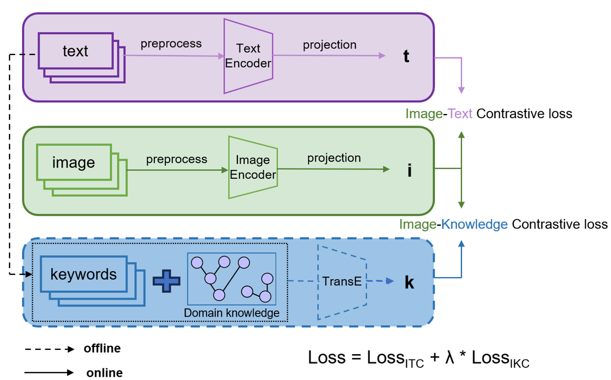

# KL-CVR
This is the implementation of [ISBI24]:[Integrating expert knowledge with vision-language model to improve medical image retrieval](https://drive.google.com/file/d/1D-KQTavwxLzsGJ_hqKv6-V4Mby4ByFET/view?usp=drive_link)

## Requirements

Run the following command to install the required packages:

```bash
pip install -r requirements.txt
```

### Pre-processing

Run the following command to translate knowledge graph to embeddings:

```angular2
python prepro/prepro_pretraining_data.py
```

to get the following files:

```angular2
root[prepro]:
+--knowledge
| +--train2id.txt
| +--relation2id.txt
| +--entity2id.txt
| +--ent_embeddings.ckpt
| +--image_node_embeddings.pkl

```

### Fine-Tuning

Now you can start to fine-tune the model from pulicly available weights pretrained by [OpenAI](https://openaipublic.azureedge.net/clip/models/5806e77cd80f8b59890b7e101eabd078d9fb84e6937f9e85e4ecb61988df416f/ViT-B-16.pt):

```angular2
python main.py
```

### Model checkpoint

We fine-tune our framework on [ROCO](https://github.com/razorx89/roco-dataset). Our weights(ViT-Base-16) are available here [Google drive](https://drive.google.com/drive/folders/1tavJ3Xsp57ezpmzLOkfhUbTBrAt6frZv?usp=drive_link). 

You can find an example of how to use our model in this file: [Jupyter notebook](https://github.com/Wxy-24/KL-CVR/blob/main/how_to_load_model.ipynb)

### Dataset adaption
This framework relies on external ontology from knowledge base UMLS.
To merge knowlegde in your dataset with existing knowledge graphs, make sure each image is paired with a set of UMLS Concept Unique Identifiers (CUIs). [Tutorial](https://github.com/Wxy-24/KL-CVR/blob/main/CUI_mapping.ipynb)

## Acknowledgement

The code is based on [OpenKE](https://github.com/thunlp/OpenKE), [CLIP](https://github.com/OpenAI/CLIP).
We thank the authors for their open-sourced code and encourage users to cite their works when applicable.
